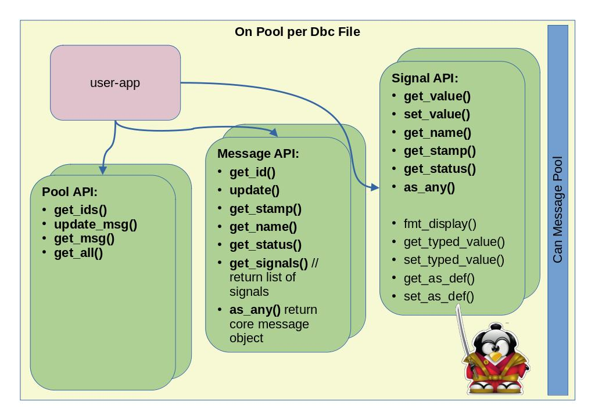

## Introduction

Following libraries/crates interfaces can-socket Linux Kernel capabilities with Rust world.

Current version supports:

* dbc-file parsing and code generator with optional canid white/black list
* raw-can for std+FD frames with optional 'by canid' filters
* bmc-socket with full options (timeout, watchdog, mask, ...)
* can message pool:

    * api to get decoded messages/signals
    * automatic subscription to dbc defined canids
    * signal value cache with status and time stamp
    * native integration with socket-bmc for timeout,watchdog,...

Under development feature (may run until summer-2026)

 * ISOTP/J1939 integration with linux kernel modules
 * Rest/worksocket API through redpesk/AFB bindings
 * integration with Kuksa-databroker

WARNING:

 * canrus-rs should remain under heavy work until end of spring-2026
 * dbc definition quickly generate huge rust parser rust code (use parser white list to reduce size)

Community Support:

* https://matrix.to/#/#redpesk-core:matrix.org
* please keep github only for push request


## Architecture

### General architecture


### Can Message Pool Apis


## Dependencies

* canutils: for can player
* clang: for build.rs

## Compiling

Note:

* Compilation regenerate parser from build.rs selected DBC file.
Depending on selected file this may generate huge rust file. TelsaM3 DBC
generate more than 30000line of rust code. For debug and test it is
recommended to force a canid whitelist within build.rs to limit the
size of generate code.

* Warning: opening a 30K lines cratch vscode, nevertheless vi/gedit still work.

```
git clone https://github.com/redpesk-labs/canbus-rs
cd canbus-rs
touch examples/dbc-log/*.dbc // force dbc parser regeneration
cargo build
```

## Install VCAN

To simulate CAN message injection, you need a vcan device

```bash
echo sudo dnf/zypper install can-utils
sudo modprobe vcan
sudo ip link add dev vcan0 type vcan
sudo ip link set vcan0 up
ip addr | grep "can"  ;# check interface is up
```

## Start a demo

* start virtual can injection
    * apt-get install can-utils;  dnf install can-utils; zypper install can-utils;
    * canplayer vcan0=elmcan -v -I ./examples/model3/etc/candump/model3.log -l i -g 10

* start can-model3

```bash
[canbus-rs]$ ${CARGO_TARGET_DIR:-./target}/debug/can-model3 vcan0 500
(1) => CanID:280 opcode:RxChanged stamp:1681732233413819
  -- DiAccelPedalPos           value:30.400   (f64) status:Updated age:0
  -- DiBrakePedalState         value:0         (u8) status:Unchanged age:0
  -- DiDriveBlocked            value:0         (u8) status:Unchanged age:0
  ...
```


Fulup:

- implementer isotp


## improve your Rust code

Use **Clippy** and **rustfmt** to keep the codebase clean, idiomatic, and consistent.

why clippy and rustfmt are mandatory in an industrial rust project?

A professional codebase needs predictability, safety, and speed of iteration. Two tools make that non-negotiable baseline real:

rustfmt enforces a single canonical style.

Clippy enforces a baseline of code quality by flagging common mistakes and non-idiomatic patterns.

Together they reduce defects, shrink review time, and make the code easier to maintain over years and teams.

### rust fmt

rustfmt (formatting you can rely on)

What it guarantees?

Zero bikeshedding: one style, produced automatically. Reviews focus on logic, not whitespace.

Stable diffs: predictable formatting reduces noisy diffs and makes git blame more meaningful.

Onboarding made easy: new contributors don’t need to learn a house style.

Tooling interoperability: editors, CI, and pre-commit hooks can all run the same formatter.

Organization policy (recommended)

Formatting is required; PRs must pass cargo fmt --all --check.

A project-local rustfmt.toml defines only needed deviations (often: none).

If you use `rustup` (recommended):

```bash
rustup update
rustup component add rustfmt
```

### run clippy

```bash
cargo fmt --all
```

### rust clippy

clippy (linting that prevents subtle bugs)

What it guarantees?

Bug prevention: catches suspicious code (unwrap() in tests ok, in prod not ok; needless clones; wrong iterator bounds; Mutex in async contexts; etc.).

Idiomatic rust: nudges toward patterns the ecosystem expects, improving readability and performance.

Security hygiene: warns about panic! in FFI, mem::uninitialized, or non-Send/Sync in shared contexts, among many others.

Organization policy (recommended)

Clippy runs on every commit and in CI with warnings elevated to errors


If you use `rustup` (recommended):

```bash
rustup update
rustup component add clippy
```

### run clippy

```bash
cargo clippy --all-targets --all-features -- -D warnings -W clippy::pedantic

    --all-targets lints libs, bins, tests, benches, examples

    --all-features checks all feature combos

    -D warnings fails the build on any warning

    -W clippy::pedantic enables extra strict lints
```

### quality gates (must pass before merge)

1. **Formatting:** `cargo fmt --all --check`
2. **Linting:** `cargo clippy --workspace --all-targets --all-features -- -D warnings`
3. **Tests:** `cargo test --workspace --all-features`
4. **Security:** `cargo audit` (no unpatched advisories) and `cargo deny check` (licenses/deps policy)
5. **Docs:** `RUSTDOCFLAGS="-D warnings" cargo doc --no-deps` (no doc warnings)
