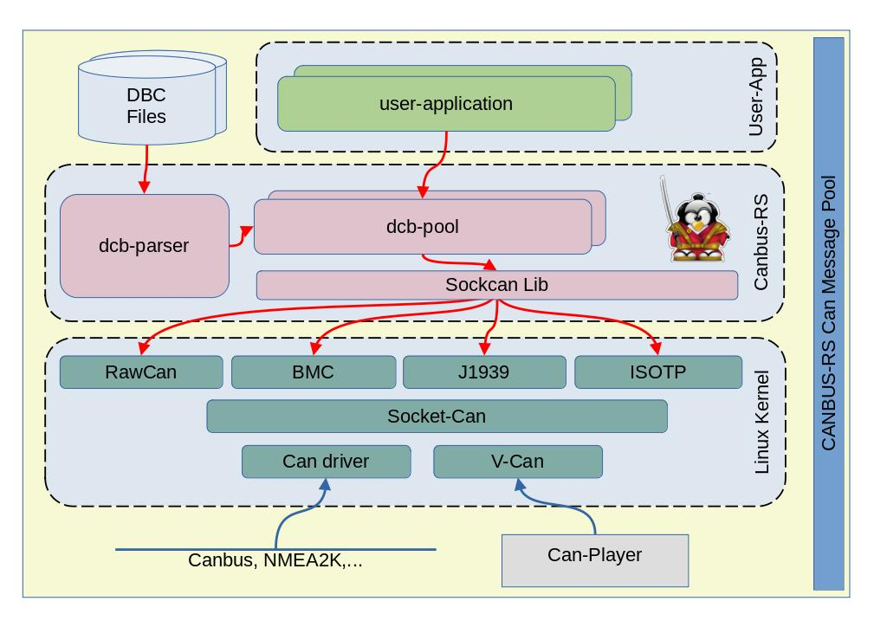

## Introduction

Following libraries/crates interfaces can-socket Linux Kernel capabilities with Rust world.

Current version supports:
* dbc-file parsing and code generator with optional canid white/black list
* raw-can for std+FD frames with optional 'by canid' filters
* bmc-socket with full options (timeout, watchdog, mask, ...)
* can message pool:

    * api to get decoded messages/signals
    * automatic subscription to dbc defined canids
    * signal value cache with status and time stamp
    * native integration with socket-bmc for timeout,watchdog,...

Under development feature (may run until summer-2023)
 * ISOTP/J1939 integration with linux kernel modules
 * NMEA 2000
 * Rest/worksocket API through redpesk/AFB bindings
 * integration with Kuksa-databroker

WARNING:
 * canrus-rs should remain under heavy work until end of spring-2023
 * dbc definition quickly generate huge rust parser rust code (use parser white list to reduce size)

Community Support:
* https://matrix.to/#/#redpesk-core:matrix.org
* please keep github only for push request


## Architecture

### General architecture


### Can Message Pool Apis


## Dependencies

* canutils: for can player
* clang: for build.rs

## Compiling

Note:

* Compilation regenerate parser from build.rs selected DBC file.
Depending on selected file this may generate huge rust file. TelsaM3 DBC
generate more than 30000line of rust code. For debug and test it is
recommended to force a canid whitelist within build.rs to limit the
size of generate code.

* Warning: opening a 30K lines cratch vscode, nevertheless vi/gedit still work.

```
git clone https://github.com/redpesk-labs/canbus-rs
cd canbus-rs
touch touch examples/dbc-log/*.dbc // force dbc parser regeneration
cargo build
```
## Install VCAN

To simulate CAN message injection, you need a vcan device

```bash
echo sudo dnf/zypper install can-utils
sudo modprobe vcan
sudo ip link add dev vcan0 type vcan
sudo ip link set vcan0 up
ip addr | grep "can"  ;# check interface is up
```

## Start a demo

* start virtual can injection
    * apt-get install can-utils;  dnf install can-utils; zypper install can-utils;
    * canplayer vcan0=elmcan -v -I examples/dbc-log/candump.log -l i -g 1

* start dnc-player
```
[fulup@fulup-laptop canbus-rs]$ ~/.cargo/build/debug/can-display vcan0 500
(1) => CanID:280 opcode:RxChanged stamp:1681732233413819
  -- DiAccelPedalPos           value:30.400   (f64) status:Updated age:0
  -- DiBrakePedalState         value:0         (u8) status:Unchanged age:0
  -- DiDriveBlocked            value:0         (u8) status:Unchanged age:0
  ...
```


